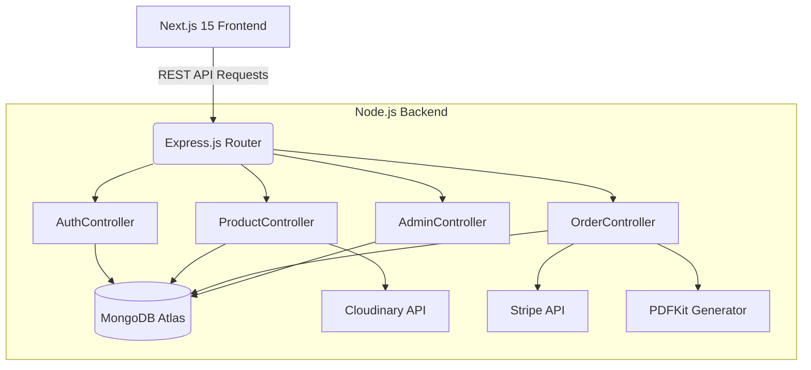

# E-COMM: Full-Stack E-Commerce Platform

A production-ready, highly scalable full-stack e-commerce application built with Next.js 15, Node.js, Express, MongoDB, and Redux Toolkit. This project serves as an advanced SDE resume project, demonstrating modern web development best practices, secure authentication, API design, testing, and containerization.

## 🌟 Key Features

- **🛍️ Complete Product Management**: Advanced search, filtering, pagination, and Cloudinary image uploads.
- **🔐 Secure Authentication**: JWT, HttpOnly cookies, password hashing (bcrypt), and Role-Based Access Control (Admin/Customer).
- **🛒 Persistent Shopping Cart & Wishlist**: MongoDB-backed cart and seamless wishlist-to-cart conversion.
- **💳 Payment & Order Processing**: Stripe integration and automated PDF Invoice generation.
- **📊 Admin Dashboard**: Full CRUD management and analytics visualization.
- **⚡ Performance Optimized**: `next/image` implementation, server components, and debounced search.

## 🏗️ Architecture

The application follows a decoupled client-server architecture, utilizing a Service Layer pattern on the backend for clean code organization.



## 🛠️ Tech Stack

**Frontend:**
- Next.js 15 (App Router)
- React, TypeScript
- Tailwind CSS
- Redux Toolkit (State Management)
- Axios, React Hook Form, Zod

**Backend:**
- Node.js, Express.js
- MongoDB, Mongoose
- JSON Web Tokens (JWT)
- Stripe, Cloudinary, PDFKit

**DevOps & Testing:**
- Docker & Docker Compose
- GitHub Actions CI/CD
- Jest, Supertest

## 🚀 Local Installation

### Prerequisites
- Node.js 18+
- Docker & Docker Compose (Optional)
- MongoDB URI
- Stripe & Cloudinary API Keys

### Method 1: Docker (Recommended)
1. Clone the repository.
2. Ensure you have a `.env` file in the root containing your `MONGO_URI`, `JWT_SECRET`, etc.
3. Run the stack:
   ```bash
   docker-compose up --build
   ```

### Method 2: Manual
1. Clone the repository.
2. **Backend**:
   ```bash
   cd backend
   npm install
   npm run build
   npm run dev
   ```
3. **Frontend**:
   ```bash
   cd frontend
   npm install
   npm run dev
   ```

## 📡 API Documentation

### Auth
- `POST /api/auth/register` - Register a new user
- `POST /api/auth/login` - Authenticate user & get token
- `POST /api/auth/logout` - Clear HttpOnly cookie

### Products
- `GET /api/products` - Get all products (supports `?keyword=`)
- `GET /api/products/:id` - Get specific product
- `POST /api/products` - Create product (Admin)

### Orders
- `POST /api/orders` - Create new order
- `GET /api/orders/:id` - Get order details
- `PUT /api/orders/:id/pay` - Update order to paid
- `GET /api/orders/:id/invoice` - Download PDF Invoice

## 🛡️ CI/CD & Deployment
This repository is configured with **GitHub Actions** (`.github/workflows/ci.yml`) to automatically lint, type-check, and run Jest tests on every push. 
- **Frontend** deployment configuration is provided via `vercel.json`.
- **Backend** deployment configuration is provided via `render.yaml`.

---
*Built as an SDE Portfolio Project.*
