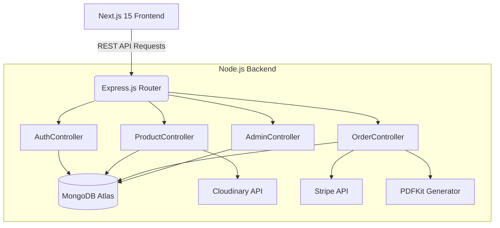

# TechCart: Full-Stack E-Commerce Platform

A production-ready, highly scalable full-stack e-commerce application built with Next.js 15, Node.js, Express, MongoDB, and Redux Toolkit. This project serves as an advanced Software Development Engineer (SDE) portfolio project, demonstrating modern web development best practices, secure authentication, robust RESTful API design, automated testing, and containerization.

## Table of Contents
- [Architecture](#architecture)
- [Key Features](#key-features)
- [Technology Stack](#technology-stack)
- [Project Structure](#project-structure)
- [Installation and Setup](#installation-and-setup)
- [Environment Variables](#environment-variables)
- [API Documentation](#api-documentation)
- [Continuous Integration and Deployment](#continuous-integration-and-deployment)

## Architecture

The application follows a decoupled client-server architecture, utilizing a Service Layer pattern on the backend for clean code organization and separation of concerns.



## Key Features

- **Product Management:** Advanced search, dynamic filtering, server-side pagination, and Cloudinary-backed image uploads.
- **Authentication & Authorization:** Secure JSON Web Token (JWT) implementation utilizing HttpOnly cookies, bcrypt password hashing, and Role-Based Access Control (Admin vs. Customer).
- **Shopping Cart & Wishlist:** MongoDB-backed cart persistence and seamless wishlist-to-cart state management via Redux Toolkit.
- **Payment Processing:** Integrated Stripe API for secure checkout flows and automated PDF Invoice generation upon successful payment.
- **Admin Dashboard:** Full CRUD management interfaces for Products, Users, and Orders, supplemented by a data analytics visualization panel.
- **Performance Optimization:** Leveraged Next.js Image component for optimized asset delivery, implement custom debouncing for search inputs, and configured Next.js standalone builds.

## Technology Stack

**Frontend:**
- Framework: Next.js 15 (App Router)
- Language: TypeScript
- Styling: Tailwind CSS
- State Management: Redux Toolkit
- Utilities: Axios, React Hook Form, Zod

**Backend:**
- Runtime: Node.js
- Framework: Express.js
- Language: TypeScript
- Database: MongoDB via Mongoose
- Security: JSON Web Tokens (JWT), bcrypt

**DevOps & Quality Assurance:**
- Containerization: Docker & Docker Compose
- CI/CD: GitHub Actions
- Testing: Jest, Supertest
- Deployment: Vercel (Frontend), Render (Backend)

## Project Structure

The repository is organized into a monorepo structure separating the client and server codebases.

- `/frontend` - Contains the Next.js application, React components, Redux slices, and UI assets.
- `/backend` - Contains the Express.js API, Mongoose models, controllers, middleware, and business logic.
- `.github/workflows` - Contains the CI/CD pipeline definitions for automated testing and linting.

## Installation and Setup

### Prerequisites
- Node.js (v18 or higher)
- Docker and Docker Compose (Optional, for containerized environments)
- MongoDB instance (Local or Atlas)
- API Keys for Stripe and Cloudinary

### Method 1: Docker (Recommended)
1. Clone the repository.
2. Create a `.env` file in the root directory mirroring the variables listed below.
3. Build and run the stack using Docker Compose:
   ```bash
   docker-compose up --build
   ```
4. Access the frontend at `http://localhost:3000` and the backend API at `http://localhost:5000`.

### Method 2: Manual Setup
1. Clone the repository.
2. Setup Backend:
   ```bash
   cd backend
   npm install
   npm run build
   npm run dev
   ```
3. Setup Frontend:
   ```bash
   cd frontend
   npm install
   npm run dev
   ```

## Environment Variables

Ensure the following environment variables are set in the `backend/.env` file:

- `NODE_ENV`: development or production
- `PORT`: 5000
- `MONGO_URI`: Your MongoDB connection string
- `JWT_SECRET`: Secure string for token signing
- `CLOUDINARY_CLOUD_NAME`: Cloudinary configuration
- `CLOUDINARY_API_KEY`: Cloudinary configuration
- `CLOUDINARY_API_SECRET`: Cloudinary configuration
- `STRIPE_SECRET_KEY`: Stripe payment configuration

## API Documentation

The backend exposes a comprehensive RESTful API. Below is a subset of the core endpoints:

### Authentication
- `POST /api/auth/register` - Register a new user profile
- `POST /api/auth/login` - Authenticate user credentials and return an HttpOnly cookie
- `POST /api/auth/logout` - Clear the active session and HttpOnly cookie

### Products
- `GET /api/products` - Retrieve a paginated list of products (supports `?keyword=` query parameters)
- `GET /api/products/:id` - Retrieve specific product details
- `POST /api/products` - Create a new product entry (Requires Admin privileges)
- `PUT /api/products/:id` - Update an existing product (Requires Admin privileges)
- `DELETE /api/products/:id` - Remove a product (Requires Admin privileges)

### Orders
- `POST /api/orders` - Submit a new order
- `GET /api/orders/:id` - Retrieve order details by ID
- `PUT /api/orders/:id/pay` - Mark an order as paid (Triggered post-Stripe validation)
- `GET /api/orders/:id/invoice` - Download a generated PDF invoice for the order

## Continuous Integration and Deployment

This repository utilizes GitHub Actions (`.github/workflows/ci.yml`) to enforce code quality. On every push to the `main` branch, the CI pipeline automatically:
1. Installs dependencies.
2. Executes TypeScript compilation checks.
3. Runs the Jest test suite across the backend API.

Deployment configurations are included within the repository:
- **Vercel** (`vercel.json`): Configured for Next.js frontend deployment.
- **Render** (`render.yaml`): Infrastructure as Code (IaC) configuration for deploying the Express backend.

---
*Developed as a comprehensive Software Engineering portfolio project.*
